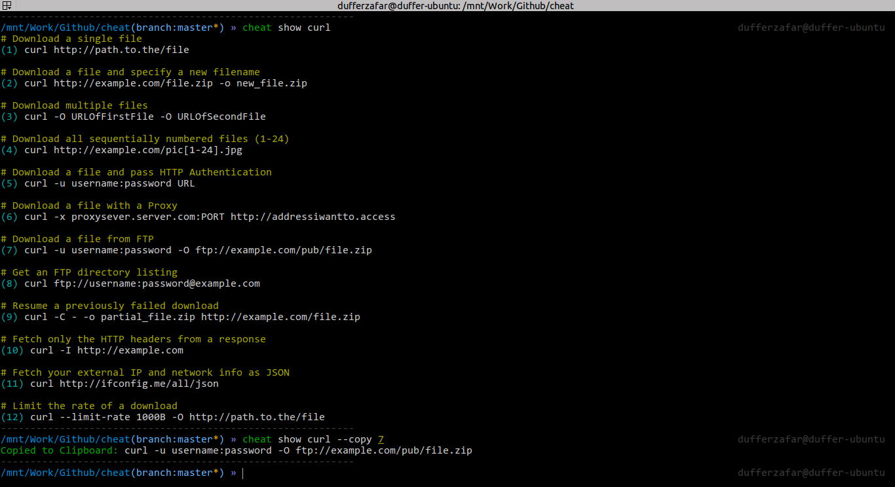

# cheat

这是一个小抄的Go版实现 [Chris Lane's cheatsheet](https://github.com/chrisallenlane/cheat) . 

修改自网上的代码(github.com/dufferzafar/cheat)作了一些修改以适合个人习惯。

尚在完善中...

# DEMO

您可以找开scwy.net网站，或者curl它。例如：curl scwy.net/su

# 更新

2018.9.19 web支持微信小程序搜索（微信搜索“腾图小抄”小程序）

2018.9.11 web支持下载小抄 (127.0.0.1/down)

2018.9.7 支持MarkDown文件（扩展名.md)

2018.9.7 多国语言支持(zh.lng，在.cheatrc中配置)

2018.9.7 添加了Web查询功能

2018.9.3 允许中文小抄与英文小抄共享，根据配置文件优先显示指定语言(计划支持多语言)

2018.9.3 允许二级目录小抄，便于分类。编辑命令cheat edit go/Point，显示cheat show go/Point

2018.9.4 允许不带默认参数，例如 cheat su 等于 cheat show su 。对引用库"github.com/urfave/cli"作了修改

# 计划

支持提交私人小抄

支持小抄下载

支持小抄查询统计

完善小抄列表功能

留言提交功能，主要还是为了便于功能改进

搜索功能

允许指定网络小抄并进行搜索

# 设置

安装: `go get github.com/soease/cheat`

获取网上原有小抄库: `cheat fetch`

测试一个: `cheat show git` 或 `cheat git`

# 用法
`.cheatrc` - 一个JSON格式的配置文件.

`cheat show git` - 显示git的小抄

`cheat edit git` - 编辑git小抄，如不存则创建

`cheat edit zh_git` - 编辑zh语言的git小抄，如不存在则创建

`cheat show git --copy 12` - 复制git的第12条小抄到剪贴板

`cheat fetch` - 更新小抄

`cheat list` - 小抄列表

`cheat list go` - 二级小抄列表

`cheat edit my/zh_git` - 编辑my目录下的中文git小抄

`cheat web` - 启动web服务

`curl 127.0.0.1/cp` - web查询cp小抄

`curl 127.0.0.1/list` - web小抄列表

`curl 127.0.0.1/list/go` - web小抄二级目录列表

# 支持开源

